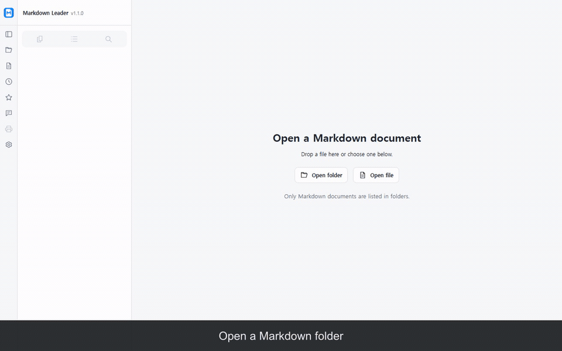

# Markdown Leader

[English](README.md) · [한국어](README.ko.md)

Markdown Leader is not a general Markdown editor. It is a human review interface for AI-written Markdown: browse and search local documents, then save checklist decisions and contextual notes in the original files.

Use it to review Markdown produced by Claude, ChatGPT, OpenAI Codex, Gemini, Google Antigravity, or other AI tools. These names describe possible document sources, not integrations or endorsements. Documents stay on your device, and Markdown Leader does not connect to an AI service. Human-authored Markdown works the same way.

Markdown Leader targets desktop Chrome 121 or later. Version 1.1.0 is publicly available in the [Chrome Web Store](https://chromewebstore.google.com/detail/markdown-leader/mglmfpabbmcifhimdlembgchpaofbogm). This repository contains the 1.2.0 source snapshot and can differ from the currently published package until the next store version is published.

## Demo

The published 1.1.0 workflow below shows folder sorting, sidebar resizing, A4/PDF preview, and reconnecting moved files.

[](assets/markdown-leader-1.1.0-demo.gif)

## Features

- Open local Markdown files from a file URL, the extension popup, a file/folder picker, or drag and drop.
- Browse a folder tree, navigate headings, and search file names or document contents.
- Read multiple documents in tabs, reorder or pin tabs, and reopen recent files and favorites.
- Render tables, highlighted code, relative images and links, footnotes, alerts, MathJax-based math, and Mermaid diagrams.
- Review checklists and attach notes to selected text, with changes saved to the original file after permission is granted.
- Preview A4 pages and use Chrome's Save as PDF flow.
- Choose light, dark, or system themes and adjust the font, text size, line spacing, and reading width.
- Refresh the active document after changes in an external editor while preserving the reading position.

MDX and MDC files render as Markdown; their components do not execute. Reading alone does not modify files. The reader does not provide a general text editor, account system, AI integration, or full tab-session restoration.

## Build and load locally

Install Node.js and pnpm, then run:

```powershell
pnpm install --frozen-lockfile
pnpm build
```

1. Open `chrome://extensions` in Chrome and enable **Developer mode**.
2. Select **Load unpacked** and choose the generated `dist` folder.
3. Open the extension's details and enable **Allow access to file URLs**.
4. Open a local Markdown file in Chrome, or choose **Open reader** from the extension popup.

## Files and privacy

Checklist and note changes require separate write permission. Notes are stored in an HTML comment at the end of the Markdown file, travel with the file, and are readable by anyone who can access its source. The extension does not upload documents or notes to a developer server. External images and links in a document can still make network requests. See the [public privacy policy](https://bohe76.github.io/markdown-leader/).

## Support

Report reproducible problems through [GitHub Issues](https://github.com/bohe76/markdown-leader/issues).

## License and attribution

[MIT](LICENSE). Markdown Leader builds on `summereasy/md-reader` at commit `58ee254a6cffbeb28c4a7ce260d4b306dcce8d20`; original copyright notices are preserved. The bundled Pretendard font keeps its OFL notice in `src/assets/fonts/OFL.txt`, and the build generates `dist/THIRD_PARTY_NOTICES.txt` for runtime dependencies.
