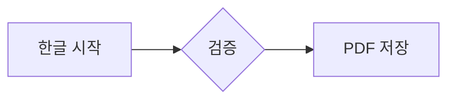

# PDF fidelity 한글 출력 검증

PDF_START_001. 한글 문단과 English text, **굵은 글씨**, *기울임*, ~~취소선~~, `inline code`를 보존합니다.

[외부 링크](https://example.com/pdf-fidelity)와 [문서 끝](#pdf-end-999)을 확인합니다.


## 목록과 수식

1. 첫 번째 항목 LIST_001
   - 중첩 항목 NESTED_001
   - 중첩 항목 NESTED_002
2. 두 번째 항목 LIST_002

> [!NOTE]
> NOTE_001 인쇄에서도 배경과 경계가 유지됩니다.

Inline $x^2 + y_1$ and display:

$$
\frac{a}{b}=\sqrt{x}+\sum_{i=1}^{n}i
$$



## 코드

```javascript
// CODE_START_001
const greeting = '한글 PDF';
function renderDocument(input) {
  return input.map((line, index) => ({ index, line }));
}
// CODE_END_001
```

## 표

| 식별자 | 이름 | 결과 |
| --- | --- | --- |
| TABLE_001 | 한글 데이터 | PASS |
| TABLE_002 | English data | PASS |

## PDF END 999

FINAL_MARKER_999 마지막 문단입니다.
