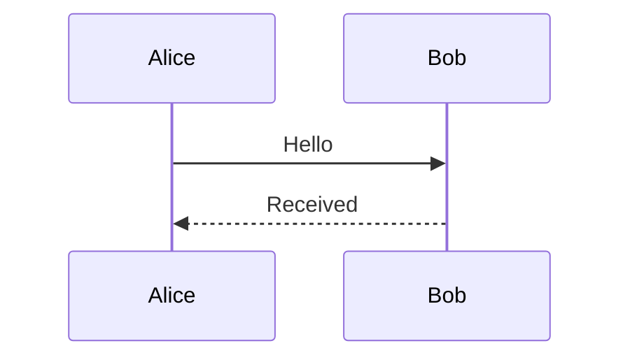
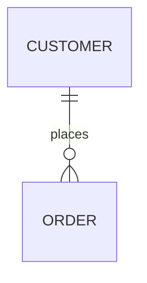

# Rendering extensions

검색단어 searchable ordinary paragraph. :smile: ==highlight== H~2~O.

> [!NOTE]
> Ordinary note.

> [!TIP]
> Useful tip.

> [!IMPORTANT]
> Important information.

> [!WARNING]
> Warning information.

> [!CAUTION]
> Caution information.

> [!NOTE] <b>Custom title</b>
> The title must remain literal text.

Reference[^reference] with a backlink.

Term
: Definition text.

## Mathematics

Inline $x^2 + y_1$ and currency $5 and $10.

$$
\frac{a}{b} = \sqrt{x}
$$

Invalid $\unknown{<b>raw</b>}$.

## Diagrams






```mermaid
flowchart LR
  A -->
```


[^reference]: Footnote definition.
